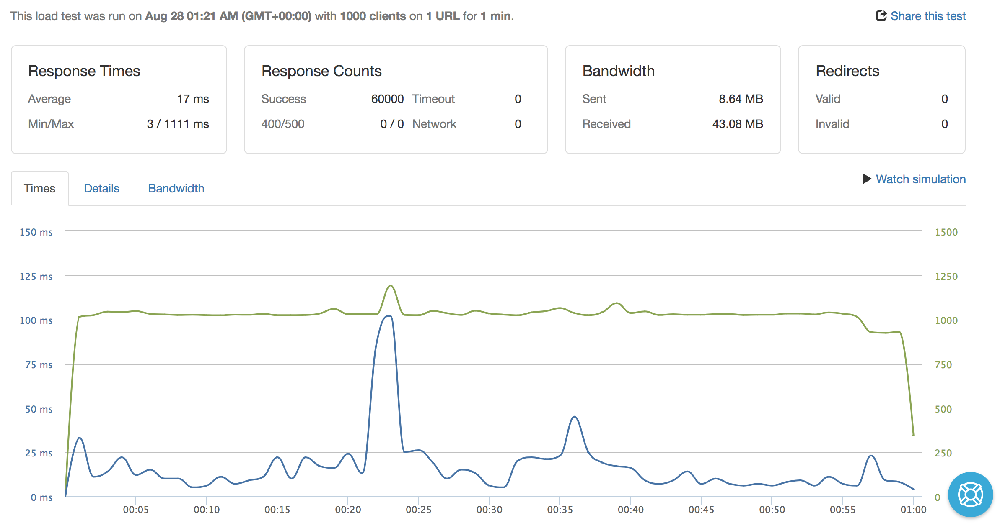

# Busbud Coding Challenge :bus: :bus:


## Features: 

- The app supports partial and complete search term.

- It supports searching by non english term, because why not? :happy:

- It support searching by term that has space or '-'.


## Heroku URLs:

- [/suggestions?q=Mont](https://busbud-city-suggestions.herokuapp.com/suggestions?q=Mont)

- [/suggestions?q=Montreal](https://busbud-city-suggestions.herokuapp.com/suggestions?q=Montreal)

- [/suggestions?q=Montréal](https://busbud-city-suggestions.herokuapp.com/suggestions?q=Montréal)

- [/suggestions?q=Montreal&latitude=45.50884&longitude=-73.58781](https://busbud-city-suggestions.herokuapp.com/suggestions?q=Montreal&latitude=45.50884&longitude=-73.58781)

- [/suggestions?q=蒙特利尔](https://busbud-city-suggestions.herokuapp.com/suggestions?q=蒙特利尔)

- [/suggestions?q=蒙特](https://busbud-city-suggestions.herokuapp.com/suggestions?q=蒙特)

- [/suggestions?q=مونتریال](https://busbud-city-suggestions.herokuapp.com/suggestions?q=مونتریال)

- [/suggestions?q=مونتر](https://busbud-city-suggestions.herokuapp.com/suggestions?q=مونتر)


## Implementation:

I've implemented the app using express js. It makes writing code easier with middleware, routes etc..

The app is using the data provided in `data/cities_canada-usa.tsv`. The data is being indexed based on these columns: `name`, `ascii`, `alternatate name`. The index in saved into memory for fast suggestion lookup. For data heavy app we would eventualy use Redis or similar distributed cache.


**How index is generated?** 

 For a given city like Montreal with this data: `id:12345, name: Montreal` the index would generate keys like:

```
M ->12345
Mo ->12345
Mon ->12345
Mont ->12345
Montr ->12345
Montre ->12345
Montrea ->12345
Montreal ->12345
```

The process is the same for the `ascii` and `alternate` columns.

Spaces and '-' are removed before creating the index so `Montreal - Ouest` will be processed as `MontrealOuest`


## Configuration :

The app is using configuration file in `config/conig.js`


## Scoring:

I did a very basic and simple scoring for now. It gets the job done but could definitely be improved. 

It compare the length search key with the length of the indexed key. The higher the better. The best is one both length are equal, if so we return `score:1`.

Latitude and longitude are taken into consideration. If we found a city with exact lat/long, we return a `score:1`.


## :rocket: Performance :rocket:

The app is caching request response for faster lookup.  It is using a simple in memory cache that never expire. It should be okay in the context of this challenge. In a real word app, an optimazed version could be to use a LRU cache strategry, Redis or other options.

**Avg. response time with 1000 request/second over 1 minute is 17ms. Please check load test result [here](http://bit.ly/2PJQtME)**

