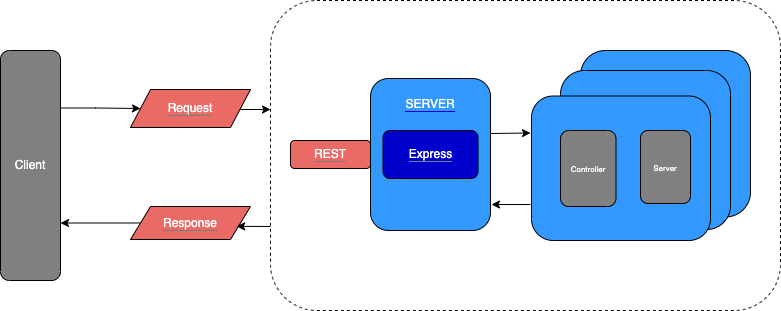

# Busbud Coding Challenge

## Getting Started

To run the application locally, following the instructions below:

1. Install node modules `npm i`
2. Start the app with `npm run start` or `npm run watch` (puts the app in a watch mode so it refreshes if any change is made)

### Starting the application

The `npm run start` command will run the `build` command before starting the application. If you only care about getting the application running, feel free to skip this section.

The `build` command transpiles the typescript files in the `src/` directory. The `build` command currently transpiles the files into the `dist` directory, which is then targeted by the start script. Transpiling these files is important since some environments are not equiped to run ES6 JavaScript/TypeScript code. AWS Lambda is a good example of this, as it only started supporting Node.js 12.x and ES6 in late 2019.

To start a local server run:

```
npm run start
```

it should produce an output similar to:

```
Server running at http://127.0.0.1:2345/suggestions
```

## Formatting

This project is configured to use Prettier formatting. Rules for code formatting are defined in <em>.prettier.js</em> file. For more information about ESLint rules and configuration visit https://prettier.io/.

To perform a lint on the project's source files, use:

```
$ npm run lint
```

## High Level Architecture

[](docs/architecture.png)

### Domain Driven Design Building Blocks

---

#### Controller

The Controller is the first layer of the application and is responsible for the orchestration and fulfillment of a request.

#### Service

This is where we locate domain logic. Domain Services are a part of the Domain Layer and adhere to the dependency rule, Domain Services aren't allowed to depend on infrastructure layer concerns.

#### Data Transfer Objects (DTO)

DTO's are predefined objects the API uses to communicate with the client providing abstraction from the domain schema. DTO's are used for both request and response payloads.

## Project Structure

The structure of this project reflects the usage of Domain Driven Design methodology and splits the project into layers to ensure that business rules don’t know anything at all about the outside world.

```
src/
    api                        # REST API
      config                   # contains REST interfaces and helpers that form a small framework to faciliate and standirize the development process
        env                    # env variables
        middlewares            # functions with access to req and res
          cacheMiddleware      # caches result based on query param provided
      routes                   # includes routers for REST API
      definition               # shared module definitions of DTOs, interfaces etc.
      controller               # validates user input, creates DTO and fulfils the client request
        test                   # tests
      service                  # validates business rules and orchestrates business logic
        test                   # tests
    ...
```

## Tests

To run unit tests, run the following:

```
$ npm run test
```

If command errors out, try the following:

```
$ npm cache clean --force

$ rm -rf node_modules

$ rm -rf package-lock.json

$ npm i

$ npm run test
```

#### Routes

**Near match**

    GET /suggestions?q=Londo&latitude=43.70011&longitude=-79.4163

```json
{
  "suggestions": [
    {
      "name": "London, ON, Canada",
      "latitude": "42.98339",
      "longitude": "-81.23304",
      "score": 0.9
    },
    {
      "name": "London, OH, USA",
      "latitude": "39.88645",
      "longitude": "-83.44825",
      "score": 0.5
    },
    {
      "name": "London, KY, USA",
      "latitude": "37.12898",
      "longitude": "-84.08326",
      "score": 0.5
    },
    {
      "name": "Londontowne, MD, USA",
      "latitude": "38.93345",
      "longitude": "-76.54941",
      "score": 0.3
    }
  ]
}
```

**No match**

    GET /suggestions?q=SomeRandomCityInTheMiddleOfNowhere

```json
{
  "suggestions": []
}
```

## Requirements

Design an API endpoint that provides autocomplete suggestions for large cities.
The suggestions should be restricted to cities in the USA and Canada with a population above 5000 people.

- the endpoint is exposed at `/suggestions`
- the partial (or complete) search term is passed as a query string parameter `q`
- the caller's location can optionally be supplied via query string parameters `latitude` and `longitude` to help improve relative scores
- the endpoint returns a JSON response with an array of scored suggested matches
  - the suggestions are sorted by descending score
  - each suggestion has a score between 0 and 1 (inclusive) indicating confidence in the suggestion (1 is most confident)
  - each suggestion has a name which can be used to disambiguate between similarly named locations
  - each suggestion has a latitude and longitude
- all functional tests should pass (additional tests may be implemented as necessary).
- the final application should be [deployed to Heroku](https://devcenter.heroku.com/articles/getting-started-with-nodejs).
- feel free to add more features if you like!

#### Sample responses

These responses are meant to provide guidance. The exact values can vary based on the data source and scoring algorithm.

**Near match**

    GET /suggestions?q=Londo&latitude=43.70011&longitude=-79.4163

```json
{
  "suggestions": [
    {
      "name": "London, ON, Canada",
      "latitude": "42.98339",
      "longitude": "-81.23304",
      "score": 0.9
    },
    {
      "name": "London, OH, USA",
      "latitude": "39.88645",
      "longitude": "-83.44825",
      "score": 0.5
    },
    {
      "name": "London, KY, USA",
      "latitude": "37.12898",
      "longitude": "-84.08326",
      "score": 0.5
    },
    {
      "name": "Londontowne, MD, USA",
      "latitude": "38.93345",
      "longitude": "-76.54941",
      "score": 0.3
    }
  ]
}
```

**No match**

    GET /suggestions?q=SomeRandomCityInTheMiddleOfNowhere

```json
{
  "suggestions": []
}
```

### Non-functional

- All code should be written in Javascript, Typescript or PHP.
- Mitigations to handle high levels of traffic should be implemented.
- Challenge is submitted as pull request against this repo ([fork it](https://help.github.com/articles/fork-a-repo/) and [create a pull request](https://help.github.com/articles/creating-a-pull-request-from-a-fork/)).
- Documentation and maintainability is a plus.

## Dataset

You can find the necessary dataset along with its description and documentation in the [`data`](data/) directory.

## Evaluation

We will use the following criteria to evaluate your solution:

- Capacity to follow instructions
- Developer Experience (how easy it is to run your solution locally, how clear your documentation is, etc)
- Solution correctness
- Performance
- Tests (quality and coverage)
- Code style and cleanliness
- Attention to detail
- Ability to make sensible assumptions

It is ok to ask us questions!

We know that the time for this project is limited and it is hard to create a "perfect" solution, so we will consider that along with your experience when evaluating the submission.

## Getting Started

### Prerequisites

You are going to need:

- `Git`
- `nvm` (or your preferred node version manager)
- `Node.js`

### Setting up your environment

1. Begin by forking this repo and cloning your fork. GitHub has apps for [Mac](http://mac.github.com/) and
   [Windows](http://windows.github.com/) that make this easier.

2. Install [nvm](https://github.com/nvm-sh/nvm#install--update-script) or your preferred node version manager.

3. Install [Node.js](http://www.nodejs.org).

### Setting up the project

In the project directory run:

```
nvm use
npm install
```

### Running the tests

The test suite can be run with:

```
npm run test
```

### Starting the application

To start a local server run:

```
npm run start
```

it should produce an output similar to:

```
Server running at http://127.0.0.1:2345/suggestions
```
