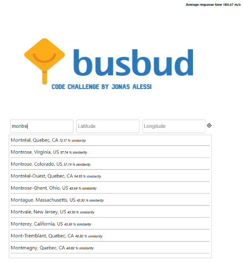
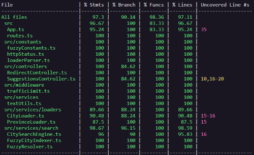

# Busbud Coding Challenge
[](https://travis-ci.org/jonasalessi/coding-challenge-backend-c)
## Challenge

Design an API endpoint that provides autocomplete suggestions for large cities.
The suggestions should be restricted to cities in the USA and Canada with a population above 5000 people.

- the endpoint is exposed at `/suggestions`
- the partial (or complete) search term is passed as a query string parameter `q`
- the caller's location can optionally be supplied via query string parameters `latitude` and `longitude` to help improve relative scores
- the endpoint returns a JSON response with an array of scored suggested matches
    - the suggestions are sorted by descending score
    - each suggestion has a score between 0 and 1 (inclusive) indicating confidence in the suggestion (1 is most confident)
    - each suggestion has a name which can be used to disambiguate between similarly named locations
    - each suggestion has a latitude and longitude
- all functional tests should pass (additional tests may be implemented as necessary).
- the final application should be [deployed to Heroku](https://devcenter.heroku.com/articles/getting-started-with-nodejs).
- feel free to add more features if you like!

------------------

## The solution

The API was developed using TypeScript and Express. The web application uses a rate limit to control the maximum of requests by an IP in a determined time.

Click [here](https://gentle-island-08430.herokuapp.com/suggestions?q=Londo&latitude=43.70011&longitude=-79.4163) to access the API sample. Also, you can use [this](https://jonasalessi.github.io/codechallenge-busbud-demo/) UI to make tests.




## How the autocomplete works

The search was developed based on a [fuzzy string set](https://glench.github.io/fuzzyset.js/), which is a technique to find a string approximately. It's divide into 3 steps:

- Separating the work in chunks of 3;
- Grouping each chunk with its total repeated, storing into a dictionary;
- Calculating the magnitude;
- In the end, to find a similarity it calculates the score using the [cosine similarity](https://en.wikipedia.org/wiki/https://en.wikipedia.org/wiki/Cosine_similarity) using the word received in the request and the data already indexed on initialization of the application.

References:
- https://glench.github.io/fuzzyset.js/
- https://en.wikipedia.org/wiki/https://en.wikipedia.org/wiki/Cosine_similarity

----------------------------------------------------------------

## Getting Started

### Prerequisites

You are going to need:

- `Git`
- `nvm` (or your preferred node version manager)
- `Node.js`

### Setting up your environment

1. Begin by forking this repo and cloning your fork. GitHub has apps for [Mac](http://mac.github.com/) and
[Windows](http://windows.github.com/) that make this easier.

2. Install [nvm](https://github.com/nvm-sh/nvm#install--update-script) or your preferred node version manager.

3. Install [Node.js](http://www.nodejs.org).

### Setting up the project

In the project directory run:

```
nvm use
npm install
```

### Running the tests

The test suite can be run with:

```
npm run test
```


### Starting the application

To start a local server run:

```
npm run start-local
```

it should produce an output similar to:

```
Server running at http://127.0.0.1:3333/suggestions
```

For development environment is better to run:

```
npm run dev
```

Because it restarts the target project when any of the required files changes.
