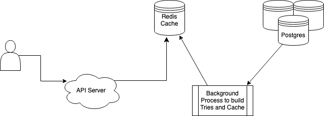

### Installation and start up
```
nvm use
npm install
npm run start
```

### Swagger
Can be accessed at the root of the domain. E.g. http://localhost:{port}/
```
npm run swagger // generates swagger based on routes
```

### Live site
https://suggestionapp.herokuapp.com/
https://suggestionapp.herokuapp.com/suggestions

### Tests
```
npm run test //end to end tests with supertest
npm run test:load // Basic k6 load tests
```
### scripts/seed.js
In a real production environment I would set up an infrastructure like below.
<br/>

<br/>
The DB would hold location data which I assume would not change too frequently. Running LIKE queries would be very intensive. Instead a background process would pull data from this db at regular N intervals, build multiple Tries for this data for each possible starting letter, and save this in a faster accessible Redis cache. Setting up all of this would be out of scope for this challenge so seed.js mimics that process so my application can continue from the stage of having fully constructed tries.
