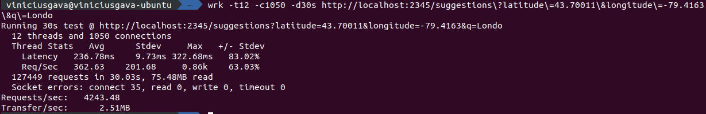
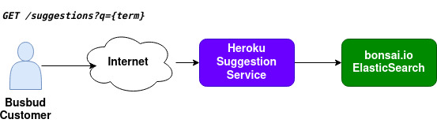

# Busbud Coding Challenge - Solution

## Challenge Requirements
You can find challenge requirements over [here](CHALLENGE.md).

## Solution
In my solution, I choose to use ElasticSearch as search engine, because it has many features like full text and geolocation search.
In the elasticsearch query, the term `q` is used for full text search get the **most similar suggestion**. After that, **geolocation position** is used to affect the **score**, if geolocation is provided.

Solution hosted by Heroku: https://busbud-challenge-viniciusgava.herokuapp.com

Please check Infrastructure section for further details. 

## Project structure
The project was designed as **hexagonal architecture**, separated as:
- **command:** Any operation that change a suggestion.
- **infrastructure:** All data access including, elasticsearch, file importing, countries and **administrative divisions**.
- **query:** Any operation for fetch data.
- **user:** User interactions, in this project, REST API layer.

### administrative divisions 
It refers to the column `admin1` of the provided file, which for:
- **USA** it is the states. I just use the provided value for USA values.
- **Canada** it is the provinces or territories. I used the geonames fipscode to figure it out the correct values. 

## Benchmark
The best benchmark results it was:
- _throughput_ of **254,000 RPM**.
- _response time avg_ of **236 milliseconds**.



It's important mention that I could get betters throughput increasing the number of concurrent connections, but it did not worth since increases the error rate and affects the response time.

### Benchmark Hardware/Environment
The benchmark was executed locally using docker container for elasticsearch and node app direct on the Operation System, Linux Ubuntu.
- AMD Ryzen 5 2600 6-core 12-threads 3.4ghz base
- 16GB RAM 16GB 3466MHz
- Storage M2 Read 2000MB/s, Write 500MB/s 

## Infrastructure 


I used **heroku** to host the application and **bonsai.io** for ElasticSearch cloud.
Since Bonsai.io free tier plan has restrictions to max of 2 concurrent operations(2 for search + 2 for index), the application performance in this environment is limited.

Maintenance endpoint are _not available_ in **heroku** also because of Bonsai.io free tier restrictions. 

## API Reference
### -Search Suggestions
Search for suggestions using a **term**. 
It will return the closest suggestion if geolocation is provided.

**URL** : `/suggestions`

**Method** : `GET`

**Query String**:
- `q`: The searched term. **Required**.
- `latitude`: Latitude to find the closest suggestions. **Optional**.
- `longitude`: Longitude to find the closest suggestions. **Optional**.

#### Success Responses
**Condition** : Suggestions have been found.

**Code** : `200 OK`

**Content** :
```json
{
  "suggestions": [
    {
      "name": "London, ON, Canada",
      "latitude": "42.98339",
      "longitude": "-81.23304",
      "score": "1.0"
    },
    {
      "name": "London, OH, USA",
      "latitude": "39.88645",
      "longitude": "-83.44825",
      "score": "0.3"
    },
    {
      "name": "Londontowne, MD, USA",
      "latitude": "38.93345",
      "longitude": "-76.54941",
      "score": "0.2"
    },
    {
      "name": "New London, CT, USA",
      "latitude": "41.35565",
      "longitude": "-72.09952",
      "score": "0.0"
    },
    {
      "name": "Londonderry, NH, USA",
      "latitude": "42.86509",
      "longitude": "-71.37395",
      "score": "0.0"
    }
  ]
}
```

##### OR
**Condition** : Suggestions have not been found.

**Code** : `404 Not Found`

**Content** :
```json
{
  "suggestions": []
}
```

#### Error response
**Condition** : A required field is missing.

**Code** : `400 Bad Request`

**Content** :
```json
{
  "error": "Querystring 'q' must be informed."
}
```

### -Maintenance - Create Index
It creates the elasticsearch index in order to persist suggestions. 

**URL** : `/maintenance/index`

**Method** : `POST`

#### Auth is Required
Inform a `Authorization` with a **Barear token** to perform maintenance operations. 

eg header: `Authorization: Bearer dev`

For **development environment** just use the token `Bearer dev`. 

#### Success Responses
**Condition** : Index created.

**Code** : `201 Created`

**Content** :
```json
{
  "status": "created"
}
```


### -Maintenance - Populate Index
It Populates the index with the file data.

**URL** : `/maintenance/populate`

**Method** : `POST`

#### Auth is Required
Inform a `Authorization` with a **Barear token** to perform maintenance operations.

eg header: `Authorization: Bearer dev`

For **development environment** just use the token `Bearer dev`.

#### Success Responses
**Condition** : Data importing is in progress.

**Code** : `200 Ok`

**Content** :
```json
{
  "status": "running"
}
```

#### Error response
**Condition** : A import is already running.

**Code** : `409 Conflict`

**Content** :
```json
{
  "status": "import is already running"
}
```

### -Maintenance - Delete Index
It deletes the elasticsearch index and all loaded data.

**URL** : `/maintenance/index`

**Method** : `DELETE`

#### Auth is Required
Inform a `Authorization` with a **Barear token** to perform maintenance operations.

eg header: `Authorization: Bearer dev`

For **development environment** just use the token `Bearer dev`.

#### Success Responses
**Condition** : Index deleted.

**Code** : `200 Ok`

**Content** :
```json
{
  "status": "deleted"
}
```

## Setting up the project
In the project directory run:
```
nvm use
npm install
docker-compose up
```
After that, let's create the elastic search index and load the data:
### Creating Elastic Search Index and load the data
Application must be running to call the endpoints.

Call the following endpoints:
1. Create index. _Api Reference: **Maintenance - Create Index**_
2. Populate the elasticsearch documents. _Api Reference: **Maintenance - Populate index**_

### Configs
**Application configs** are available at `config.js` in the project directory.

### Running the tests
```
npm run test
```

### Starting the application
```
npm run start
```

it should produce an output similar to:

```
Server running at http://127.0.0.1:2345/suggestions
```

### Running lint
```
npm run lint
```
**OR**
```
npm run lintfix
```
for autofix the code.

### Running allchecks = Lint + tests 
```
npm run allchecks
```

## Data
all data was imported using the provided file. Endpoints to reimport all data can be found on the Api Reference.

