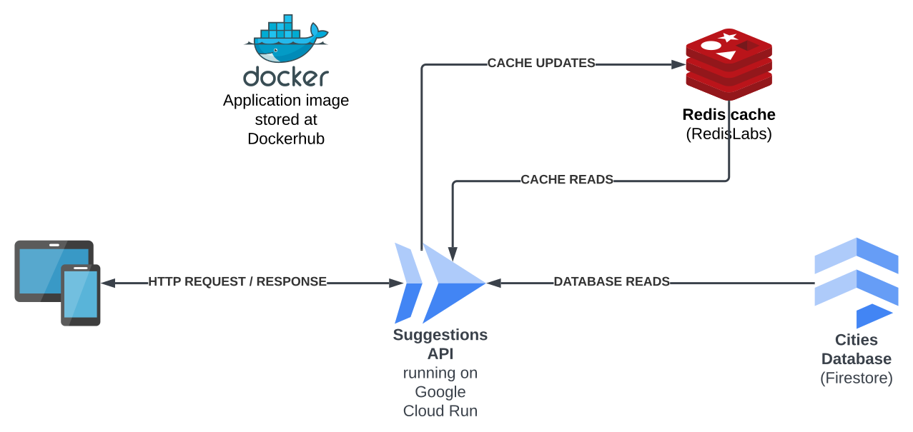
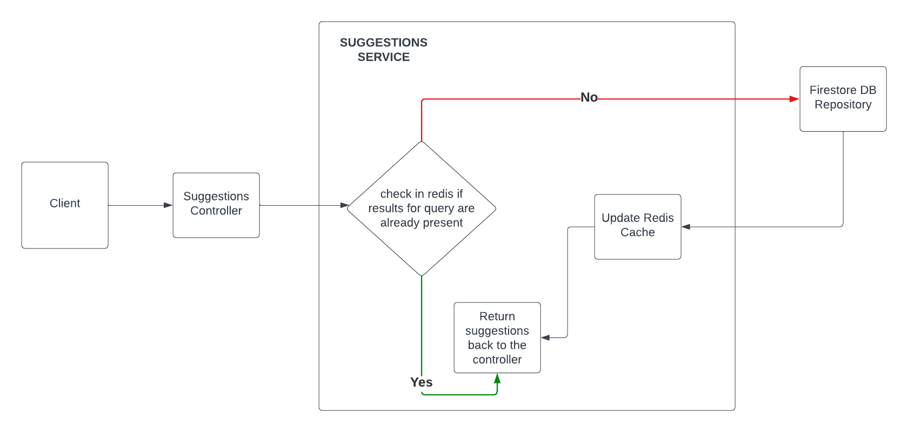

# ARCHITECTURE

## Resources used
1. GCP Cloud Run to deploy the application
2. Dockerhub for storing docker image
3. RedisLabs Redis Cache (set to refresh every 24 hours)
4. GCP Firestore as the database

## Flow Diagram for /suggestions API

